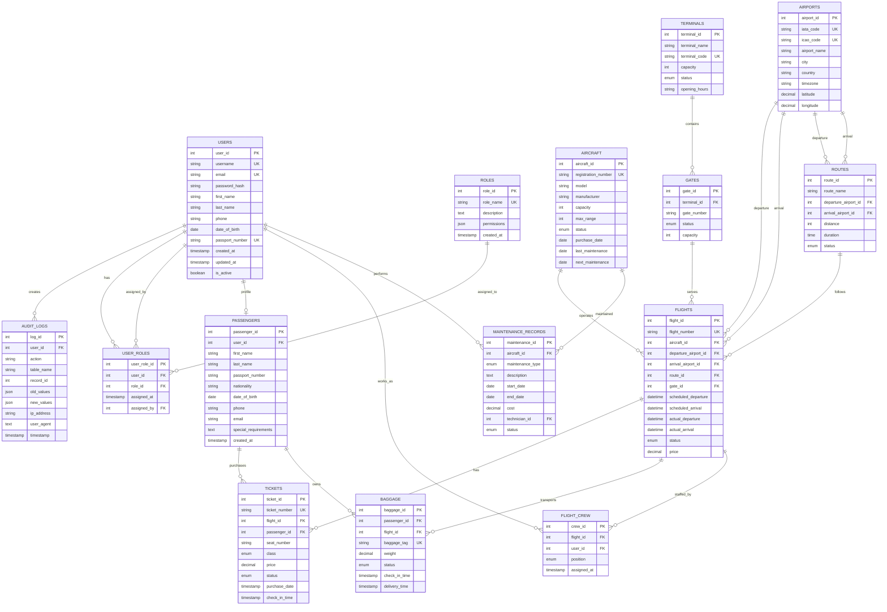

# Mermaid ER-диаграмма базы данных аэропорта

## Описание связей

### Связи "Один ко многим" (1:M):
- **USERS → AUDIT_LOGS** - один пользователь создает много записей в журнале
- **AIRCRAFT → FLIGHTS** - один самолет выполняет много рейсов
- **AIRCRAFT → MAINTENANCE_RECORDS** - один самолет имеет много записей обслуживания
- **FLIGHTS → TICKETS** - один рейс имеет много билетов
- **FLIGHTS → BAGGAGE** - один рейс перевозит много багажа
- **FLIGHTS → FLIGHT_CREW** - один рейс обслуживается многими членами экипажа
- **PASSENGERS → TICKETS** - один пассажир покупает много билетов
- **PASSENGERS → BAGGAGE** - один пассажир имеет много единиц багажа
- **TERMINALS → GATES** - один терминал содержит много гейтов
- **GATES → FLIGHTS** - один гейт обслуживает много рейсов
- **AIRPORTS → FLIGHTS** - один аэропорт является отправлением/прибытием для многих рейсов
- **AIRPORTS → ROUTES** - один аэропорт участвует в многих маршрутах
- **ROUTES → FLIGHTS** - один маршрут используется для многих рейсов
- **USERS → FLIGHT_CREW** - один пользователь работает на многих рейсах
- **USERS → MAINTENANCE_RECORDS** - один пользователь выполняет много работ по обслуживанию

### Связи "Многие ко многим" (M:M):
- **USERS ↔ ROLES** (через USER_ROLES) - пользователь может иметь несколько ролей, роль может быть назначена нескольким пользователям
- **FLIGHTS ↔ USERS** (через FLIGHT_CREW) - рейс может иметь несколько членов экипажа, пользователь может работать на нескольких рейсах

### Связи "Один к одному" (1:1):
- **USERS ↔ PASSENGERS** - пользователь может иметь профиль пассажира (опционально)

## Особенности диаграммы

1. **Первичные ключи (PK)** - уникальные идентификаторы сущностей
2. **Внешние ключи (FK)** - ссылки на первичные ключи других таблиц
3. **Уникальные ключи (UK)** - поля с ограничением уникальности
4. **Типы данных** - указаны основные типы (int, string, date, enum, etc.)
5. **Связи** - показаны все типы связей между сущностями

## Использование диаграммы

Эта Mermaid диаграмма может быть отображена в:
- GitHub/GitLab (автоматически)
- VS Code с расширением Mermaid
- Онлайн редакторах (mermaid.live)
- Документации проектов

Диаграмма наглядно показывает структуру базы данных и все взаимосвязи между сущностями системы управления аэропортом.
