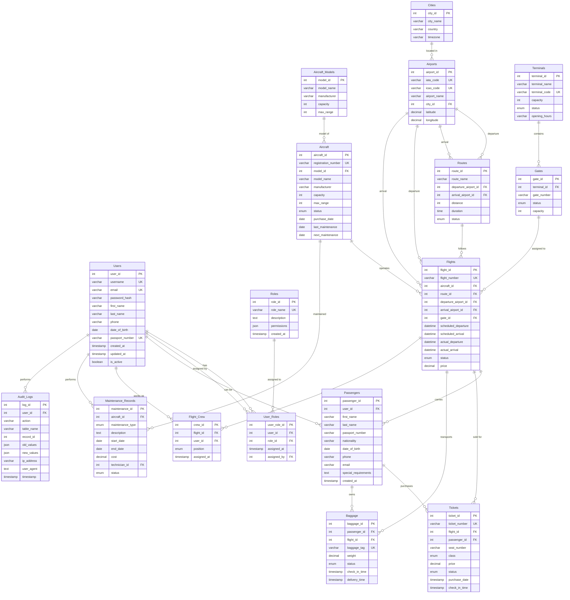

# Диаграмма нормализованной базы данных

## ER-диаграмма нормализованной БД системы управления аэропортом

## Описание изменений в нормализации

### Новые таблицы:
1. **Aircraft_Models** - справочник моделей самолетов
2. **Cities** - справочник городов и стран

### Модифицированные таблицы:
1. **Aircraft** - добавлена связь с Aircraft_Models, денормализованы характеристики модели
2. **Airports** - добавлена связь с Cities
3. **Routes** - добавлен уникальный ключ по паре аэропортов
4. **Gates** - добавлен уникальный ключ по терминалу и номеру гейта
5. **Flights** - денормализованы аэропорты отправления и прибытия

### Обоснование денормализации:
- **Aircraft**: характеристики модели денормализованы для быстрого доступа при расчетах загрузки
- **Flights**: аэропорты денормализованы для частых запросов информации о рейсах без JOIN операций

### Преимущества нормализации:
1. Устранение транзитивных зависимостей
2. Снижение избыточности данных
3. Улучшение целостности данных
4. Упрощение обновлений справочной информации

### Преимущества денормализации:
1. Повышение производительности запросов
2. Уменьшение сложности запросов
3. Оптимизация для типичных операций системы
